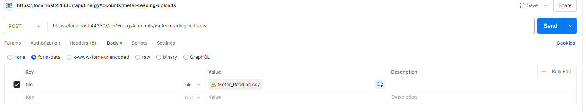

# ENSEK Technical Test
## _Fynn Bodley-Davies_

An ASP.NET api that reads a .CSV file, saves it to a database, and returns upload response (and an associated WinForms consumer client just for fun :))

### two projects
- Ensek Technical Test
- Esnek App

### To run this you will need:
- A up and running SQL server, and its associated connection string
- An IDE from which to run both projects
- Postman (if you dont want to us the client)

## Before Running

- Chuck the connection string details for your SQL server into the connectionstring tag in the appsettings file, by default this is set to _localhost\\SQLEXPRESS;Initial Catalog=ensekDB;_ *YOU WILL NEED A PREXISTING DATABASE TO BE ACTIVE, if you don't want to call it ensekDB, change it in the connectionstring;

- update the connectionString in AppModel with the base URL that the API ends up using (may be different if you try to run it without ISS express, be default this is _https://localhost:44330/api/EnergyAccounts/_)

## How to run

- Run the ENSEK Technical Test in ISS Express, if everythings gone well, a swagger page should open up.
- After confirming that appModel has the correct URI, debug => 'start new instance' for the ENSEK app project.

### POSTMAN SHOULD LOOK LIKE THIS

